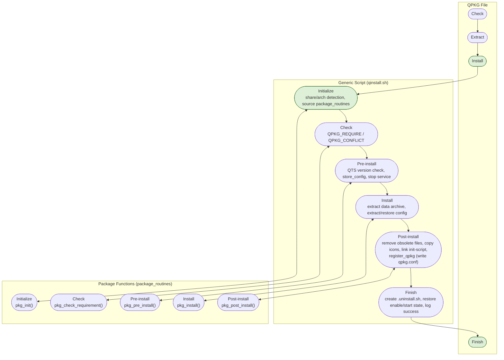

# QDK Developer Guide

A comprehensive, up-to-date reference for **QDK (QPKG Development Kit)** — the toolkit used to build
and install QPKG packages for QNAP NAS devices (QTS / QuTS hero).

This guide consolidates and supersedes the older *QDK 2.0 Reference Manual* and the *QDK Cookbook*,
updated against the current source in this repository (QDK v2.5.3). It is written for developers who are
packaging an application as a QPKG and need one place that documents every configuration key,
variable, function, and CLI option QDK exposes.

> Related documents:
> - `README.md` (repository root) — install instructions and changelog.
> - This guide's [Cookbook](#12-cookbook-common-recipes) section for task-oriented recipes.

## Table of Contents

1. [Overview](#1-overview)
2. [Installing QDK](#2-installing-qdk)
3. [Directory Layout](#3-directory-layout)
4. [Quick Start](#4-quick-start)
5. [qpkg.cfg Reference](#5-qpkgcfg-reference)
6. [package_routines Reference](#6-package_routines-reference)
7. [Installation Runtime Internals (qinstall.sh)](#7-installation-runtime-internals-qinstallsh)
8. [Init Script Template](#8-init-script-template)
9. [qbuild CLI Reference](#9-qbuild-cli-reference)
10. [QDK_* Build Variables Reference](#10-qdk_-build-variables-reference)
11. [User Configuration File (~/.qdkrc) and Build Scripts](#11-user-configuration-file-qdkrc-and-build-scripts)
12. [Cookbook: Common Recipes](#12-cookbook-common-recipes)
13. [Supported Architectures](#13-supported-architectures)
14. [Code Signing & Anti-Tampering](#14-code-signing--anti-tampering)
15. [QPKG Binary Format (Appendix)](#15-qpkg-binary-format-appendix)
16. [References](#16-references)

---

## 1. Overview

QDK builds a **QPKG** — a self-extracting shell archive containing an application's files plus metadata
— that QNAP's App Center / web interface can install, upgrade, enable, disable, and remove. QDK gives
a package maintainer near-total control over how the package behaves at install time while keeping the
common case (a static, platform-independent application) simple.

Key capabilities:

- Architecture checks at installation (reject the wrong CPU/platform).
- Digital signatures (GPG) and QNAP-internal code signing / anti-tampering.
- Multiple compression formats (gzip, bzip2, 7-zip, xz).
- Dependency management against other QPKGs and (legacy) Optware/ipkg packages.
- Configuration-file lifecycle handling across upgrades (`.qdkorig` / `.qdksave`).
- A scriptable build pipeline (`setup` → `pre-build` → build → `post-build` → `teardown`) for
  cross-compiling or fetching architecture-specific binaries.

QDK is distributed under the GPL.

## 2. Installing QDK

### On a NAS (QPKG)

Download and install the QDK QPKG through App Center or the CLI. Once installed and enabled, QDK
creates the system-wide configuration file `/etc/config/qdk.conf` and symlinks `qbuild` into `/usr/bin`,
making it available on the shell.

### On Ubuntu / Debian (cross-build host)

```
# wget https://github.com/qnap-dev/QDK/releases/download/v2.5.3/qdk_2.5.3_${platform}.deb
# sudo apt install ./qdk_2.5.3_${platform}.deb
```

> **Note:** From QTS 4.2.0 onward, Optware is no longer supported by QTS itself; `QPKG_REQUIRE`/
> `OPT/<pkg>` dependency handling still exists in QDK for legacy packages, but new packages should not
> rely on Optware.

### Installed layout

```
bin/
    qbuild
scripts/
    qinstall.sh
template/
    arm-x41/ arm_64/ x86/ x86_64/
    config/
    icons/
    shared/init.sh
    package_routines
    qpkg.cfg
qdk
```

- **`qdk`** — the init-script used to enable/disable the QDK QPKG itself. It symlinks `bin/qbuild` into
  `/usr/bin` (and unpacks a bundled `xz` toolchain if needed) when enabled, and removes the symlinks
  when disabled.
- **`bin/qbuild`** — the build CLI (see [section 9](#9-qbuild-cli-reference)).
- **`scripts/qinstall.sh`** — the generic runtime installation script embedded in every QPKG built with
  QDK. Never edit this file directly; all package-specific behavior goes in `package_routines`.
- **`template/`** — skeleton copied into a new build environment by `qbuild --create-env NAME`.

## 3. Directory Layout

A QDK build root (the directory `qbuild` operates on, default `.`) is organized as:

| Path | Purpose |
|---|---|
| `qpkg.cfg` | QPKG metadata/configuration (required). |
| `package_routines` | Package-specific install/removal hooks (required, may be empty of hooks). |
| `shared/` | Files common to all architectures, added to the data archive before architecture-specific files (so arch files can override shared files). |
| `arm-x41/`, `arm_64/`, `x86/`, `x86_64/` | Architecture-specific file trees; presence of a non-empty directory tells `qbuild` to build for that architecture. |
| `config/` | Full-path configuration files — mirror the target filesystem layout under this directory (e.g. `config/etc/config/myApp.conf` installs to `/etc/config/myApp.conf`). Use this only for files that live **outside** the QPKG directory; files under `$SYS_QPKG_DIR` belong in `shared`/arch dirs instead. |
| `icons/` | `${QPKG_NAME}.gif` (64×64, enabled), `${QPKG_NAME}_gray.gif` (64×64, disabled), `${QPKG_NAME}_80.gif` (80×80, info dialog). Defaults are used if omitted. |
| `build/` | Default output directory for built `.qpkg` files (override with `--build-dir`). |

## 4. Quick Start

```
# cd `getcfg QDK Install_Path -f /etc/config/qpkg.conf`   # or wherever qbuild is on PATH
# qbuild --create-env MyQPKG
# cd MyQPKG
```

1. **Configure** `qpkg.cfg` — at minimum `QPKG_NAME`, `QPKG_VER`, `QPKG_AUTHOR` (see [section 5](#5-qpkgcfg-reference)).
2. **Add files** — platform-independent files go in `shared/`, platform-specific files in the matching
   architecture directory, icons in `icons/`, external configuration files in `config/`. Remove any
   architecture directories you don't use so `qbuild` doesn't try to build for them.
3. **Customize routines** — define hooks in `package_routines` (see [section 6](#6-package_routines-reference))
   and edit the init script `shared/<name>.sh` (start/stop/restart; see [section 8](#8-init-script-template)),
   then point `QPKG_SERVICE_PROGRAM` at it.
4. **Build**:
   ```
   # qbuild
   ```
   The resulting `.qpkg` file(s) — one per detected/requested architecture, or one generic package if no
   architecture directories are used — appear in `build/`.
5. **Install/test** — either copy the `.qpkg` to a NAS and install via App Center, or, during iterative
   development, skip repackaging entirely (see [Recipe: Faster build process during development](#faster-build-process-during-development)).

## 5. qpkg.cfg Reference

`qpkg.cfg` is a shell-sourced file defining `QPKG_*` (and optionally `QDK_*`) variables. `qbuild` performs
a sanity check at build time: it refuses to build unless `QPKG_NAME`, `QPKG_VER`, and `QPKG_AUTHOR`
are set; a missing `QPKG_SERVICE_PROGRAM` produces a warning only. Names/versions containing a
space are truncated to the part before the first space (with a warning); `QPKG_NAME` is capped at 20
characters and `QPKG_VER` at 10 characters.

### Required

| Key | Description |
|---|---|
| `QPKG_NAME` | Package name, ≤ 20 chars, no whitespace. |
| `QPKG_VER` | Package version, ≤ 10 chars, no whitespace. Prefer alphanumerics, `.`, `-`. |
| `QPKG_AUTHOR` | Author/maintainer of the package. |

### Common

| Key | Description |
|---|---|
| `QPKG_DISPLAY_NAME` | Display name shown in the QTS Web UI (defaults to `QPKG_NAME`). |
| `QPKG_LICENSE` | e.g. `GPLv2+`, `GPLv3+`, `BSD`, `Commercial`. |
| `QPKG_SUMMARY` | One-line description. |
| `QPKG_RC_NUM` | Preferred start/stop sequence number. (Ignored by QTS after a reboot — the actual number is reassigned based on order in `qpkg.conf`, starting at 100.) |
| `QPKG_SERVICE_PROGRAM` | Path to the start/stop script; also shown as the App Center start/stop button. Must support `start`/`stop`/`restart`. |
| `QPKG_DISABLE_APPCENTER_UI_SERVICE` | `1` = hide the App Center start/stop button, but still run the service script on enable/disable (and on removal). Internally the script path is registered under the `Alt_Shell` field in `qpkg.conf` instead of `Shell`. |
| `QPKG_RELEASE` | Build-number suffix; normally set via `qbuild --build-number`, not hand-edited. |
| `QPKG_SYS_APP` | Written to the `Sys_App` field in `qpkg.conf`. Since QTS 4.3, a value of `2` marks the QPKG as non-removable (the "Remove" action is blocked). Not exposed in the shipped `qpkg.cfg` template comments, but read by `qbuild`/`qinstall.sh`. |

### Dependencies

| Key | Description |
|---|---|
| `QPKG_REQUIRE` | Comma-separated requirements. Each entry: package name + optional version comparison (`=`,`!=`,`<`,`>`,`<=`,`>=`) + version. `\|` separates OR-alternatives within one entry. Prefix `OPT/` for an Optware/ipkg package (auto-installed if missing/wrong version, including from a bundled `QDK_EXTRA_FILE`). Example: `QPKG_REQUIRE="Python >= 2.7, Optware | opkg, OPT/openssh"`. Installation aborts with a system-log message if unmet. |
| `QPKG_REQUIRE_MSG` | Custom message shown in the system log when `QPKG_REQUIRE` is unmet. |
| `QPKG_CONFLICT` | Same format as `QPKG_REQUIRE` (no `\|` support) — packages that must **not** be installed. |

### Configuration files

| Key | Description |
|---|---|
| `QPKG_CONFIG` | Path (relative to `$SYS_QPKG_DIR`, or absolute) of a configuration file needing upgrade-safe handling. Repeatable for multiple files. See [section 7](#configuration-file-lifecycle-qdkorig--qdksave) for the `.qdkorig`/`.qdksave` behavior. Files generated at install time must be built with `--force-config` (or `QDK_FORCE_CONFIG=TRUE`). |

### Networking / service

| Key | Description |
|---|---|
| `QPKG_SERVICE_PORT` | Port used by the service program. |
| `QPKG_SERVICE_PIDFILE` | Path to the running service's PID file. |
| `QPKG_TIMEOUT` | `"start_timeout,stop_timeout"` in seconds (QTS ≥ 4.1.0). The first value is how long QTS waits for the service to finish *starting* before giving up; the second is how long it waits when *stopping* the service, including during system shutdown. |

### Web UI / Desktop App

| Key | Description |
|---|---|
| `QPKG_WEBUI` | Relative path to the web interface (must start with `/`); defaults to `/` if `QPKG_WEB_PORT` is set and this is empty. Link is only shown when enabled. Special value `QTS_desktop` opens the app purely inside the QTS desktop framework (requires a symlink from `/home/httpd/cgi-bin/qpkg/<QPKG_NAME>` to the app's web folder and a `config.json`, set up by `pkg_post_install`). |
| `QPKG_WEB_PORT` | HTTP port for the web UI, written to the `Web_Port` field. `0`/empty (default) = same as the QTS web server (80). `-1` = same as the QTS system httpd port (8080). `-2` = HTTP is not supported. |
| `QPKG_WEB_SSL_PORT` | HTTPS port for the web UI, written to `Web_SSL_Port`. `0`/empty (default) = same as the QTS web server's SSL port (8081). `-1` = same as the QTS system httpd's SSL port (443). `-2` = HTTPS is not supported. |
| `QPKG_USE_PROXY` | `1` = route through the QTS HTTP proxy (default port 8080) — useful for myQNAPcloud reachability. |
| `QPKG_PROXY_PATH` | Proxy path prefix, e.g. `/qpkg_name`. |
| `QPKG_DESKTOP_APP` | Since QTS 4.1: `0` = new browser tab, `1` = iFrame on QTS desktop, `2` = desktop-only (since QTS 4.4.1). |
| `QPKG_DESKTOP_APP_WIN_WIDTH` | Default inner window width, max `1178`. |
| `QPKG_DESKTOP_APP_WIN_HEIGHT` | Default inner window height, max `600`. |
| `QPKG_VISIBLE` | Main-menu visibility (requires `QPKG_WEBUI`): `0` admin only, `1` (default) administrators, `2` all users. |
| `QPKG_FORCE_VISIBLE` | Overrides `QPKG_VISIBLE`: `1` administrators only, `2` all users, `3` (default) no override. |

### Version / platform gating

| Key | Description |
|---|---|
| `QTS_MINI_VERSION` | Minimum QTS version, checked against `/etc/default_config/uLinux.conf` (and `/etc/default_config/uLinux.conf` fallback for NAS detection since v2.5.3). |
| `QTS_MAX_VERSION` | Maximum QTS version. |
| `QPKG_VOLUME_SELECT` | Volume install/migration behavior (QTS ≥ 4.2.1): `0` default volume, `1` select volume to install, `2` select volume to migrate, `3` both, `4` select volume, no default. |
| `QPKG_DISTRIBUTION_TYPE` | `0` (default) updates published via PGM-maintained XML; `1` not published that way. |

### Lifecycle callback hooks

| Key | Description |
|---|---|
| `QPKG_SHARE_ADD_ACTION` / `QPKG_SHARE_DEL_ACTION` | Script run after a shared folder is created / before it's removed. |
| `QPKG_MOUNT_ACTION` / `QPKG_UNMOUNT_ACTION` | Script run after a volume is mounted / before it's unmounted. |
| `QPKG_ENTER_READDELETE_ACTION` / `QPKG_LEAVE_READDELETE_ACTION` | Script run before a volume enters / after it leaves Read/Delete mode. |
| `QPKG_ENTER_HERO_{NOTICE,CAUTION,WARNING,CRITICAL}_LOW_ACTION` / `QPKG_LEAVE_HERO_..._LOW_ACTION` | QuTS hero 5.2.x low-space threshold callbacks. |
| `QPKG_ACTION_TIMEOUT` | Timeout (seconds) for the callbacks above; default 15. |

### Other qpkg.conf runtime fields (no qpkg.cfg key exists)

QTS recognizes a number of additional per-QPKG fields in `/etc/config/qpkg.conf` that `qbuild`/
`qinstall.sh` never write — there is **no** `qpkg.cfg` key for these. If your package needs one, set it
directly in `pkg_post_install()` (after `register_qpkg` has run), e.g.:

```sh
$CMD_SETCFG "$QPKG_NAME" Role_Delegation "7,8" -f "$SYS_QPKG_CONFIG_FILE"
```

| qpkg.conf field | Description |
|---|---|
| `Class` | If this QPKG is bundled under another QPKG (e.g. HD Station), the internal name of that parent QPKG. |
| `Need_Configure` | `0` (default) no post-install configuration needed; `1` the QPKG needs to be configured in its own GUI after install; `2` the QPKG does not need to be stopped during the install procedure. |
| `Dependency` | Colon-separated list of other QPKGs this one depends on, e.g. `Dependency=JRE:Nginx:PHP7`. This is evaluated by QTS itself and is **separate from** QDK's own `QPKG_REQUIRE`/`QPKG_CONFLICT` handling in `qinstall.sh` — setting one does not set the other. |
| `App_ID` | ID used by Notification Center and other system integrations, e.g. `A050`. |
| `Open_In` | Controls what App Center's "Open" action launches — an app ID plus an optional comma-separated parameter forwarded to the desktop framework's `os.openApp()`. |
| `Open_With_URL` | For apps with their own web front-end: the convention used to open a specific file path/resource directly. |
| `App_Route` / `App_Route_Rule` | Per-app network routing rule control (`0` disabled, `1` outgoing packets follow the rule; `2`/`3` incoming-bind variants are reserved/not ready). |
| `Task_Info` / `Task_Method` | Background task metadata and its HTTP method (`GET`/`POST`). |
| `Win_Width` / `Win_Height` | Default desktop-app window size (system defaults `1030`×`600` if unset) — **do** have a `qpkg.cfg` equivalent: set via `QPKG_DESKTOP_APP_WIN_WIDTH`/`QPKG_DESKTOP_APP_WIN_HEIGHT` instead of setting this field directly. |
| `Win_Max_Width` / `Win_Max_Height` / `Win_Min_Width` / `Win_Min_Height` | Desktop-app window size bounds — no `qpkg.cfg` equivalent at all. |
| `Role_Delegation` | Delegated-administration role ID(s) that let a non-admin user use this app, e.g. `Role_Delegation=7,8`. |

### Code signing (QNAP-internal)

| Key | Description |
|---|---|
| `QNAP_CODE_SIGNING` | `1` to enable QNAP code signing for this QPKG. |
| `QNAP_CODE_SIGNING_SERVER_IP` | Default `codesigning.qnap.com.tw`; `qbuild` itself forces `codesigning.qnap.com:5001`. |
| `QNAP_CODE_SIGNING_SERVER_PORT` | Default `5001`. |
| `QNAP_CODE_SIGNING_CSV` | Default `build_sign.csv`. |

### Legacy / deprecated

| Key | Description |
|---|---|
| `QPKG_CONFIG_DIR` | Deprecated; `qbuild` warns but does not auto-migrate — use `QDK_DATA_DIR_CONFIG` instead. |
| `QDK_EXTRA_SRC_FILE` | Deprecated alias of `QDK_EXTRA_FILE`. |

`QDK_*` build-time variables (compression, extra files, architecture data directories, etc.) may also be
set inside `qpkg.cfg` — see [section 10](#10-qdk_-build-variables-reference).

## 6. package_routines Reference

`package_routines` is a shell file sourced by `qinstall.sh` at install/upgrade time. All variables from
`qpkg.cfg` and all `SYS_*`/`CMD_*` definitions (section 7) are available inside it. It is optional to define
any of the hooks below — only define what you need.

### Lifecycle hook functions

Called only if defined (via `command -v`), in this order:

| Function | Called from | Purpose |
|---|---|---|
| `pkg_init()` | `init()` — first, before anything else | Package-specific initialization (e.g. `add_qpkg_config` for legacy config files). |
| `pkg_check_requirement()` | `check_requirements()`, after built-in `QPKG_REQUIRE`/`QPKG_CONFLICT` checks | Extra, package-specific requirement validation. |
| `pkg_pre_install()` | `pre_install()`, after config backup and service stop, before extraction | Pre-install actions. |
| `pkg_install()` | `install()`, after data/config extraction and config restore | Main install actions — the most commonly used hook. |
| `pkg_post_install()` | `post_install()`, after obsolete-file cleanup, icon copy, init-script linking, and `register_qpkg` | Final registration/cleanup actions. |

A hook should only `return` on success or an ignorable condition — return values are otherwise
discarded. To abort installation/upgrade with an error, call `err_log "message"`.

### Removal snippets

Not functions — shell code blocks inlined verbatim into the generated `.uninstall.sh`:

```sh
PKG_PRE_REMOVE="{
    # before the QPKG directory is removed
}"
PKG_MAIN_REMOVE="{
    # after the directory / init-script symlinks / icons are removed
}"
PKG_POST_REMOVE="{
    # final removal step
}"
```

Because these are expanded once at *build* time into the generated uninstall script, any `$VAR` or
`` `command` ``/`$(command)` that should be evaluated at *removal* time (not build time) must be escaped
as `\$VAR` / `\$(command)`.

### Support functions available inside routines

| Function | Purpose |
|---|---|
| `log MSG` | Write MSG to stdout and the system log. |
| `warn_log MSG` | Write MSG to stderr and the system log. |
| `err_log MSG` | Write MSG to stderr and the system log, notify the web interface, restore backed-up config, and **abort** the install/upgrade. Message is prefixed with `"$QPKG_NAME $QPKG_VER installation failed."`. |
| `get_share_path "SHARE NAME" VARNAME` | Resolve a system share's on-disk path into `VARNAME`. |
| `add_qpkg_config FILE MD5SUM` | Register `FILE` (and its original MD5) in `qpkg.conf` if not already registered — use to adopt a pre-existing configuration file into upgrade-safe handling (see [Cookbook](#handle-unknown-configuration-files)). Use MD5 `0` for files generated at install time. |
| `set_qpkg_config FILE MD5SUM` | Update the MD5 recorded for an already-registered configuration file — use after programmatically migrating an installed config so it isn't flagged `.qdksave` next upgrade (see [Cookbook](#qdksave-files-are-created-at-upgrade)). |
| `extract_data ARCHIVE [DIR]` | Extract a tar archive to `DIR` (default `$SYS_QPKG_DIR`) — used for extra archives bundled via `QDK_EXTRA_FILE`. |
| `is_equal A B`, `is_unequal A B`, `is_less A B`, `is_less_or_equal A B`, `is_greater A B`, `is_greater_or_equal A B` | Compare two `MAJOR.MINOR.BUILD`-style version strings; return 0 (success) or 1. |
| `is_qpkg_not_installed NAME [OP VER]` | True if the named QPKG (or `OPT/`-prefixed Optware package) is not installed / doesn't satisfy the version check. |
| `is_qpkg_enabled NAME [OP VER]` | True if the named package is installed, enabled, and satisfies the version check; will attempt auto-install via the detected package tool if not. |

## 7. Installation Runtime Internals (qinstall.sh)

`qinstall.sh` is the generic install/upgrade driver embedded in every QPKG. It is split into four phases —
**init → check → pre-install → install → post-install → finish** — interleaving generic steps with the
package-specific hooks from section 6:



Each generic-script phase calls out to its package-specific hook (if defined) and returns before advancing
to the next phase — see [Lifecycle hook functions](#lifecycle-hook-functions) in section 6 for what each hook
receives and is expected to do.

On a fresh install the QPKG is disabled by default; on an upgrade its previous enabled/disabled state is
restored after `post-install` (the service is started if it was enabled — if start fails, state falls back to
disabled). A hook can force this by setting `SYS_QPKG_SERVICE_ENABLED` to `TRUE`/`FALSE`.

### `SYS_*` variables

| Variable | Description |
|---|---|
| `SYS_EXTRACT_DIR` | Directory the QPKG's files were extracted into (assigned at runtime). |
| `SYS_HOSTNAME` | NAS host name. |
| `SYS_CONFIG_DIR` | `/etc/config` |
| `SYS_INIT_DIR` | `/etc/init.d` |
| `SYS_STARTUP_DIR` | `/etc/rcS.d` |
| `SYS_SHUTDOWN_DIR` | `/etc/rcK.d` |
| `SYS_RSS_IMG_DIR` | `/home/httpd/RSS/images` (App Center icons) |
| `SYS_DEFAULT_ULINUX_CONF` | `/etc/default_config/uLinux.conf` (NAS detection / QTS version source) |
| `SYS_QPKG_BASE` | Volume root containing the Public share, e.g. `/share/MD0_DATA`. |
| `SYS_QPKG_INSTALL_PATH` | `$SYS_QPKG_BASE/.qpkg` |
| `SYS_QPKG_DIR` | `$SYS_QPKG_INSTALL_PATH/$QPKG_NAME` — the installed package directory. |
| `SYS_QPKG_DATA_FILE_GZIP` / `_BZIP2` / `_7ZIP` / `_XZ` | Candidate data-archive filenames (`./data.tar.gz`, `.bz2`, `.7z`, `.xz`). |
| `SYS_QPKG_DATA_FILE` | Whichever candidate above actually exists, assigned at runtime. |
| `SYS_QPKG_DATA_CONFIG_FILE` | `./conf.tar.gz` — full-path config files archive. |
| `SYS_QPKG_DATA_MD5SUM_FILE` | `./md5sum` |
| `SYS_QPKG_DATA_BUILTVER_FILE` / `_BUILTINFO_FILE` | `./built_version`, `./built_info` |
| `SYS_QPKG_DATA_PACKAGES_FILE` | `./Packages.gz` — generated Optware package index, if `QDK_EXTRA_FILE` includes Optware packages. |
| `SYS_QPKG_CONFIG_FILE` | `$SYS_CONFIG_DIR/qpkg.conf` — the system-wide package registry. |
| `SYS_QPKG_SERVICE_ENABLED` | Desired enabled/disabled state after install/upgrade; see above. Safe for hooks to modify. |
| `SYS_CPU_ARCH` | Detected architecture from `uname -m` (`arm-x41`/`arm_64`/`x86`/`x86_64`). |
| `SYS_PUBLIC_SHARE`/`_PATH`, `SYS_DOWNLOAD_SHARE`/`_PATH`, `SYS_MULTIMEDIA_SHARE`/`_PATH`, `SYS_RECORDINGS_SHARE`/`_PATH`, `SYS_USB_SHARE`/`_PATH`, `SYS_WEB_SHARE`/`_PATH` | Name and on-disk path of each standard system share. |

`SYS_QPKG_CONF_FIELD_*` constants name the fields QDK reads/writes in `/etc/config/qpkg.conf` (e.g.
`SYS_QPKG_CONF_FIELD_ENABLE="Enable"`, `SYS_QPKG_CONF_FIELD_INSTALL_PATH="Install_Path"`) —
treat these as read-only; use the `set_qpkg_*` functions instead of editing `qpkg.conf` directly.

### `CMD_*` command aliases

Fixed absolute paths to standard NAS busybox/coreutils tools, defined once so `package_routines`
doesn't depend on `$PATH`:

`CMD_AWK`, `CMD_CAT`, `CMD_CHMOD`, `CMD_CHOWN`, `CMD_CP`, `CMD_CUT`, `CMD_DATE`, `CMD_ECHO`,
`CMD_EXPR`, `CMD_FIND`, `CMD_GETCFG` (`/sbin/getcfg`), `CMD_GREP`, `CMD_GZIP`, `CMD_HOSTNAME`,
`CMD_LN`, `CMD_LOG_TOOL` (`/sbin/log_tool`), `CMD_MD5SUM`, `CMD_MKDIR`, `CMD_MV`, `CMD_RM`,
`CMD_RMDIR`, `CMD_SED`, `CMD_SETCFG` (`/sbin/setcfg`), `CMD_SLEEP`, `CMD_SORT`, `CMD_SYNC`,
`CMD_TAR`, `CMD_TOUCH`, `CMD_WGET`, `CMD_WLOG` (`/sbin/write_log`), `CMD_XARGS`, `CMD_7Z`,
`CMD_QSH` (`/usr/local/sbin/qsh`), and `CMD_PKG_TOOL` (path to `ipkg`/`opkg` if present, empty otherwise).

### Configuration file lifecycle (`.qdkorig` / `.qdksave`)

For every path listed in `QPKG_CONFIG`, `store_config` (called during `pre_install`) compares the live
installed file's MD5 against two references: the MD5 recorded at the file's *original* install
(`cfg:<file>` in `qpkg.conf`), and the *new* package's shipped MD5.

| Live file vs. recorded MD5s | Result |
|---|---|
| Unchanged (matches either) | Left alone / restored unmodified after extraction. |
| Changed, **no prior record** (first time this file is tracked) | Renamed to `<file>.qdkorig`; new package's file installed; system log message. |
| Changed, differs from **both** original and new MD5 (user customized it) | Renamed to `<file>.qdksave`; new package's file installed; system log message. |

To adopt a config file that predates `QPKG_CONFIG` tracking (so it isn't needlessly flagged
`.qdkorig` on the first upgrade), call `add_qpkg_config FILE MD5` in `pkg_init()`. To acknowledge that an
already-tracked, locally-modified file is still valid after you've programmatically patched it, call
`set_qpkg_config FILE MD5` with the new package's MD5, in `pkg_init()`, **before** the pre-install
comparison runs.

Enable/disable state and the install path both live in `/etc/config/qpkg.conf` under a `[QPKG_NAME]`
section (`Enable`, `Install_Path` fields), maintained via `register_qpkg`/`set_qpkg_status`.

## 8. Init Script Template

Every QDK-generated build environment ships a start/stop skeleton at `shared/init.sh` (renamed to
`shared/<name>.sh` when the environment is created), which the current template implements as:

```sh
start)
    ENABLED=$(/sbin/getcfg $QPKG_NAME Enable -u -d FALSE -f $CONF)
    if [ "$ENABLED" != "TRUE" ]; then
        echo "$QPKG_NAME is disabled."
        exit 1
    fi
    : ADD START ACTIONS HERE
    ;;
stop)
    : ADD STOP ACTIONS HERE
    ;;
restart)
    $0 stop
    $0 start
    ;;
*)
    echo "Usage: $0 {start|stop|restart|remove}"
    exit 1
    ;;
```

Because QDK only has two states for a QPKG (enabled/disabled), always use this exact `Enable` check
when converting a hand-written init script — see [Cookbook: A disabled service is restarted at
reboot](#a-disabled-service-is-restarted-at-reboot) for the bug this avoids.

## 9. qbuild CLI Reference

```
usage: qbuild [--extract QPKG [DIR]] [--create-env NAME] [-s|--section SECTION]
    [--root ROOT_DIR] [--build-arch ARCH] [--build-version VERSION]
    [--build-number NUMBER] [--build-model MODEL] [--build-dir BUILD_DIR] [--force-config]
    [--setup SCRIPT] [--teardown SCRIPT] [--pre-build SCRIPT]
    [--post-build SCRIPT] [--exclude PATTERN] [--exclude-from FILE]
    [--gzip|--bzip2|--7zip|--xz {amd64|armhf}] [--sign] [--gpg-name ID] [--verify QPKG]
    [--add-sign QPKG] [--import-key KEY] [--remove-key ID] [--list-keys]
    [--query OPTION QPKG] [-v|--verbose] [-q|--quiet] [--strict]
    [--add-code-signing QPKG] [--verify-code-signing QPKG]
    [--code-signing-cfg CODE_SIGNING_CFG]
    [--code-signing-key-version QNAP_CODE_SIGNING_KEY_VERSION]
    [--allow-no-volume]
    [-?|-h|--help] [--usage] [-V|--version]
```

### Environment / build-root

| Option | Description |
|---|---|
| `--create-env NAME` | Create a template build environment named `NAME` in the current directory. |
| `--root ROOT_DIR` | Use files/metadata in `ROOT_DIR` (default: current directory). |
| `-s SECTION`, `--section SECTION` | Add `SECTION` to the list of sections read from `~/.qdkrc`; repeatable. |

### Build control

| Option | Description |
|---|---|
| `--build-version VERSION` | Override `QPKG_VER` for this build (also updates `qpkg.cfg`). |
| `--build-number NUMBER` | Set a build number, embedded as `QPKG_RELEASE`. |
| `--build-model MODEL` | Add a model-tag check to the built QPKG (enforced by the web installer only). |
| `--build-arch ARCH` | Build for `ARCH` (`arm-x41`, `arm_64`, `x86`, `x86_64`). One per option; repeat to build multiple. Default: inferred from non-empty architecture directories. |
| `--build-dir BUILD_DIR` | Output directory for built packages (default `ROOT_DIR/build`). |
| `--force-config` | Ignore configuration files listed in `QPKG_CONFIG` that don't exist yet in the build tree (they're created at install time). |
| `--gzip` / `--bzip2` / `--7zip` / `--xz {amd64\|armhf}` | Data-archive compression. `gzip` is the default. `xz` also bundles a small `xz` toolchain for NAS firmware lacking native `xz`. |
| `--exclude PATTERN` | Exclude files matching `PATTERN` from the data package (rsync `--exclude` semantics). Repeatable. |
| `--exclude-from FILE` | Same, but patterns read from `FILE` (one per line). |
| `--strict` | Treat warnings as errors. |
| `--allow-no-volume` | Allow install to proceed at `/mnt/HDA_ROOT/update_pkg` if no data volume is found. |

### Build-lifecycle scripts

| Option | Description |
|---|---|
| `--setup SCRIPT` | Run once, before the build process starts. |
| `--pre-build SCRIPT` | Run before each architecture's build; receives `(ARCH, ARCH_DIR)`, empty for a generic build. |
| `--post-build SCRIPT` | Run after each architecture's build; same arguments. |
| `--teardown SCRIPT` | Run once, after all builds finish. |

See [section 11](#build-scripts) for details and a worked example.

### Signing (GPG)

| Option | Description |
|---|---|
| `--sign` | Sign the built QPKG using the keyring at `QDK_GPG_PUBKEYRING` (default `/etc/config/qpkg.gpg`). |
| `--gpg-name ID` | Sign using the private key identified by `ID`. |
| `--verify QPKG` | Verify an existing QPKG's signature. |
| `--add-sign QPKG` | (Re-)sign an already-built QPKG, replacing any existing signature. QPKG must have been built with QDK ≥ 2.0. |
| `--import-key KEY` | Import an ASCII-armored public key into the keyring. |
| `--remove-key ID` | Remove a key from the keyring. |
| `--list-keys` | List keys in the keyring. |

### Signing (QNAP internal code signing)

| Option | Description |
|---|---|
| `--add-code-signing QPKG` | Add QNAP code-signing signature to an already-built QPKG (uses `./qpkg.cfg` by default). |
| `--verify-code-signing QPKG` | Verify a QPKG's QNAP code-signing signature. |
| `--code-signing-cfg FILE` | Config file used by the two options above. |
| `--code-signing-key-version VERSION` | Signing key version (default `v1`); also usable at normal build time. |

### Inspecting packages

| Option | Description |
|---|---|
| `--extract QPKG [DIR]` | Extract a QPKG's control/data archives into `DIR` (default `.`) without installing it. |
| `--query OPTION QPKG` | Read metadata without extracting. `OPTION` ∈ `dump` (all `qpkg.cfg` settings), `info` (summary), `config` (configuration files), `require` (dependencies), `conflict` (conflicts), `funcs` (package-specific functions). |

### Output / misc

| Option | Description |
|---|---|
| `-q`, `--quiet` | Suppress all but error output. |
| `-v`, `--verbose` | Increase verbosity (repeatable, max effectively debug level). |
| `-?`, `-h`, `--help` | Full help text. |
| `--usage` | Brief usage line. |
| `-V`, `--version` | Print the QDK version. |

## 10. QDK_* Build Variables Reference

Set these in `/etc/config/qdk.conf` (system-wide), `~/.qdkrc` (user, sectioned — see [section 11](#user-configuration-file-qdkrc)),
in `qpkg.cfg`, or in a build script. Command-line flags override `~/.qdkrc`, which overrides
`/etc/config/qdk.conf`; `qpkg.cfg`/build-script values can override any of those.

| Variable | Description |
|---|---|
| `QDK_VERSION`, `QDK_PATH` | QDK's own version and install path (set in `qdk.conf`). |
| `QDK_USER_CONFIG_FILE` | Location of the user config file. Default `~/.qdkrc`. |
| `QDK_QPKG_CONFIG` | Location of `qpkg.cfg`. Default `qpkg.cfg` in the current directory. |
| `QDK_PACKAGE_ROUTINES` | Location of `package_routines`. Default same-named file in the current directory. |
| `QDK_SCRIPTS_DIR` | Directory with qbuild's script files. Default `$QDK_PATH/scripts`. |
| `QDK_TEMPLATE_DIR` | Directory of templates used by `--create-env`. Default `$QDK_PATH/template`. |
| `QDK_INSTALL_SCRIPT` | Generic install script to embed. Default `$QDK_SCRIPTS_DIR/qinstall.sh`. |
| `QDK_VERBOSE` | 0 quiet, 1 normal (default), 2 verbose, 3 debug. |
| `QDK_STRICT` | `TRUE` = warnings are fatal. Default `FALSE`. |
| `QDK_FORCE_CONFIG` | `TRUE` = ignore missing `QPKG_CONFIG` files (they're created at install). Default `FALSE`. |
| `QDK_ROOT_DIR` | Root of files/metadata for the build. Default current directory. |
| `QDK_BUILD_DIR` | Output directory. Default `$QDK_ROOT_DIR/build`. |
| `QDK_BUILD_VERSION` / `QDK_BUILD_RELEASE` / `QDK_BUILD_MODEL` / `QDK_BUILD_ARCH` | Build-time overrides for version / release number / model tag / target architecture(s) (comma-separated). |
| `QDK_DATA_FILE` | Pre-built data archive to use as-is, skipping data-package assembly (icons/arch dirs are then ignored, but `QDK_EXTRA_FILE` is still bundled). |
| `QDK_DATA_DIR_SHARED` | Shared-files directory. Default `shared`. |
| `QDK_DATA_DIR_CONFIG` | Full-path config-files directory. Default `config`. |
| `QDK_DATA_DIR_ICONS` | Icons directory. Default `icons`. |
| `QDK_DATA_DIR_X41` / `_ARM_64` / `_X86` / `_X86_64` | Per-architecture file directories. Defaults are directories named after the architecture (e.g. `arm-x41`). |
| `QDK_EXTRA_FILE` | Extra file(s) (e.g. `.ipk`/`.opk`, arbitrary archives) bundled into the QPKG's extra-data archive; repeatable. Optware packages here get an auto-generated `Packages.gz` index for local-repository installation. |
| `QDK_COMPRESS_METHOD` | `gzip` (default) \| `bzip2` \| `7zip` \| `xz`. |
| `QDK_COMPRESS_FILE` / `QDK_CONTROL_FILE` | Internal archive filenames (rarely need overriding). |
| `QDK_XZ_ARCH` | Toolchain arch bundled with `--xz` (`amd64`/`armhf`). |
| `QDK_RSYNC_EXCLUDE` / `QDK_RSYNC_EXCLUDE_FROM` | Rsync exclude pattern(s) / exclude-patterns file for the data package. |
| `QDK_SETUP` / `QDK_PRE_BUILD` / `QDK_POST_BUILD` / `QDK_TEARDOWN` | Build-lifecycle scripts (see [section 11](#build-scripts)). |
| `QDK_DATA_PACKAGE_ADAPTOR` | Script (relative to the data directory) run inside the assembled data package to adapt file ownership, etc. |
| `QDK_SIGN` / `QDK_SIGNATURE` (`gpg` only) / `QDK_GPG_APP` (default `gpg2`) / `QDK_GPG_NAME` / `QDK_GPG_PUBKEYRING` (default `/etc/config/qpkg.gpg`) / `QDK_GPG_KEYPATH` | GPG signing configuration; mirrors the `--sign`/`--gpg-name` flags. |
| `QDK_MD5SUM_APP` | md5sum binary to use. Default `md5sum`. |
| `QDK_ALLOW_NO_VOLUME` | Mirrors `--allow-no-volume`. |
| `QDK_QPKG_FILE` | Name of the most recently built QPKG (in `$QDK_BUILD_DIR`); available to post-build/teardown scripts for post-processing (e.g. upload). Reset before each pre-build script runs. |

### Deprecated aliases

Still honored with a warning: `QDK_SRC_DIR`→`QDK_ROOT_DIR`, `QDK_SRC_X41`/`ARM_64`/`X86`/`X86_64`→
the matching `QDK_DATA_DIR_*`, `QDK_SRC_SHARED`→`QDK_DATA_DIR_SHARED`, `QDK_SRC_ICONS`→
`QDK_DATA_DIR_ICONS`, `QDK_SRC_CONFIG`→`QDK_DATA_DIR_CONFIG`, `QDK_SRC_FILE`→`QDK_DATA_FILE`.
`QPKG_CONFIG_DIR` and `QDK_EXTRA_SRC_FILE` are also deprecated but **not** auto-migrated — update
these manually.

## 11. User Configuration File (~/.qdkrc) and Build Scripts

### User configuration file

`~/.qdkrc` (or the path in `QDK_USER_CONFIG_FILE`) holds named `[SECTION]` blocks of `QDK_*`
variable assignments. The `DEFAULT` section is always applied; sections named with `-s`/`--section` on
the command line are applied on top of it.

```ini
[DEFAULT]
QDK_PRE_BUILD=pre_build.sh

[myApp]
QDK_BUILD_DIR=/share/QPKG
QDK_SETUP=setup.sh
QDK_STRICT=TRUE
```

```
# qbuild -s myApp
```

Repeat `-s SECTION` to layer multiple sections. This is the mechanism behind
[Cookbook: Same options have to be repeated at every build](#same-options-have-to-be-repeated-at-every-build).

### Build scripts

QDK supports four script hooks, run in this order across the whole invocation:

```
setup (once) → [pre-build → build → post-build] per architecture → teardown (once)
```

- **`setup`** (`--setup` / `QDK_SETUP`) — runs before anything is validated; useful for generating
  `qpkg.cfg`/`package_routines` on the fly, or one-time environment prep (e.g. starting an ssh-agent).
- **`pre-build`** (`--pre-build` / `QDK_PRE_BUILD`) — runs once per architecture (and once for a
  generic build), receiving `(ARCH, ARCH_DIR)` as `$1 $2` (empty for generic). Runs after `qpkg.cfg`/
  `package_routines` existence has been checked and `QDK_BUILD_ARCH` resolved. Typical use:
  fetch/build an architecture-specific binary, or toggle `QDK_EXTRA_FILE` for that arch only.
- **`post-build`** (`--post-build` / `QDK_POST_BUILD`) — runs after each architecture's package is
  built; `$QDK_QPKG_FILE`/`$QDK_BUILD_DIR` point at the just-built file for post-processing.
- **`teardown`** (`--teardown` / `QDK_TEARDOWN`) — runs once, after every architecture is built;
  clean up temporary files/credentials here.

All four scripts must use `return` (not `exit`) to report status — `exit` would terminate `qbuild` itself, not
just the script. A non-zero return aborts the build. They can use:

```sh
err_msg MSG       # always fatal
warn_msg MSG      # fatal only if QDK_STRICT=TRUE
msg MSG
verbose_msg MSG
debug_msg MSG
```

and `qpkg.cfg` values can be edited in-place with:

```sh
edit_qpkg_config FIELD VALUE [path-to-qpkg.cfg]
```

**Worked example** — cross-building a binary per architecture via remote build hosts, configured once in
`~/.qdkrc`:

```ini
[DEFAULT]
QDK_SETUP=setup.sh
```

```sh
# setup.sh
#!/bin/sh
QDK_BUILD_ARCH="arm-x41,x86"
QDK_PRE_BUILD=build.sh
QDK_TEARDOWN=cleanup.sh

cat > "$QDK_PRE_BUILD" <<'EOF'
#!/bin/sh
case "$1" in
    arm-x41) HOST=hugin ;;
    x86)     HOST=munin ;;
esac
[ -n "$HOST" ] && ssh "qdk@$HOST" 'otr-build' && scp "qdk@$HOST:/opt/result/otr.so" "$1"
EOF

cat > "$QDK_TEARDOWN" <<'EOF'
#!/bin/sh
rm -f arm-x41/otr.so x86/otr.so "$QDK_PRE_BUILD" "$QDK_TEARDOWN"
EOF
```

See also [Cookbook: Different extra architecture files shall be included](#different-extra-architecture-files-shall-be-included)
for the pre-build/post-build pattern used to swap `QDK_EXTRA_FILE` per architecture.

## 12. Cookbook: Common Recipes

Task-oriented recipes for situations that recur across QPKG projects. (Consolidated from the QDK
Cookbook and cross-checked against the current source.)

### Faster build process during development

**Problem:** Repeatedly modifying `package_routines` and rebuilding the full QPKG is slow.

**Solution:** Extract the QPKG once to a working directory and iterate by re-running its installer directly:

```
# sh qinstall.sh
```

**Discussion:** Building re-compresses the data archive and re-concatenates the control/data/extra
archives every time — unnecessary overhead if you're only testing `package_routines` logic. Editing the
extracted copy and re-running `qinstall.sh` short-circuits packaging entirely. Remember to port the final
changes back into the real `package_routines` before your next `qbuild`.

### Handle unknown configuration files

**Problem:** Adding `QPKG_CONFIG` for a file that already existed in a previous, non-tracking version of
the package causes it to be replaced (saved as `.qdkorig`) on the very first upgrade, instead of preserved.

**Solution:**

```sh
pkg_init(){
    add_qpkg_config myApp.conf 6d7fce9fee47aa94118b5b6e47267f03
}
```

**Discussion:** QDK can't trust an untracked file to be compatible with the new package, so by default it
backs it up and replaces it. `add_qpkg_config FILE MD5` (MD5 of the file as shipped in the *original*
package) tells QDK to treat it as already-known. It is a no-op if the file is already tracked, so it's safe to
call unconditionally in `pkg_init`.

### External configuration file

**Problem:** A configuration file must live outside the QPKG directory (e.g. under `/etc/config`).

**Solution:** Set `QPKG_CONFIG` to the file's full path, and place the file itself (mirroring that path) under
the build root's `config/` directory (`QDK_DATA_DIR_CONFIG`).

**Discussion:** Alternatively you could place the file inside the QPKG directory and symlink to it from the
external location — but that only works if the external location sits on a real HDD volume (e.g.
`/etc/config`). If the external location is on the RAM disk, the symlink approach is the *only* viable option.

### Configuration file created at installation

**Problem:** The configuration file doesn't exist in the build tree — it's generated at install time.

**Solution:** List it in `QPKG_CONFIG` anyway, and build with `--force-config`.

**Discussion:** `qbuild` normally fails if a `QPKG_CONFIG` entry is missing from the package. `--force-config`
(or `QDK_FORCE_CONFIG=TRUE`) tells it the file will exist by the time install runs, and assigns it an
implicit MD5 of `0` — which upgrades then handle correctly without clobbering a locally modified file.

### .qdksave files are created at upgrade

**Problem:** A locally modified configuration file gets replaced at upgrade and backed up as `.qdksave`.

**Solution:** In `pkg_init()`, migrate the installed file's content as needed, then tell QDK the file is
current:

```sh
set_qpkg_config CONFIG_FILE MD5SUM   # MD5SUM = the new package's shipped file
```

**Discussion:** This is QDK's default, safe behavior when it can't tell whether a user's local edits are still
compatible with the new package's file — the old file is preserved as `.qdksave` and a fresh copy
installed. If you, the package builder, know exactly what changed (e.g. one new key was added) you can
instead patch the *installed* file programmatically (`$CMD_GREP` to check if already patched,
`$CMD_SED`/`$CMD_ECHO` to apply the patch) and then call `set_qpkg_config` to mark it current. This
must run in `pkg_init`, before the pre-install phase compares configuration files.

### A disabled service is restarted at reboot

**Problem:** The QPKG is disabled in the web interface, but the service still starts after a reboot.

**Solution:** Fix the enabled-check in the init script to `exit 1` when disabled — but only on `start`, not on
`stop` (the QPKG is already disabled before the init script runs to stop it, so a check on `stop` would
prevent the service from ever being stopped).

```sh
start)
    ENABLED=$(/sbin/getcfg $QPKG_NAME Enable -u -d FALSE -f $CONF)
    if [ "$ENABLED" != "TRUE" ]; then
        echo "$QPKG_NAME is disabled."
        exit 1
    fi
    ...
```

**Discussion:** This mostly bites hand-written init scripts inherited from a pre-QDK package (which often
only print a message instead of exiting, and/or try to distinguish an `UNKNOWN`/first-run state that QDK
doesn't have — QDK only has enabled/disabled). New QDK build environments already ship the correct
check in `shared/init.sh` (see [section 8](#8-init-script-template)) — when converting an existing package, replace
the old check with that version rather than patching it in place.

### Same options have to be repeated at every build

**Problem:** The same `qbuild` flags need to be passed on every invocation.

**Solution:** Put them under a named section in `~/.qdkrc` and build with `-s SECTION`:

```ini
[myApp]
QDK_BUILD_DIR=/share/QPKG
QDK_SETUP=setup.sh
QDK_STRICT=TRUE
```

```
# qbuild -s myApp
```

### Source code repository meta files are included in package

**Problem:** VCS metadata directories (e.g. `.svn`) end up inside the built QPKG.

**Solution:** `qbuild --exclude .svn/`

**Discussion:** Files are staged into a common directory (via rsync) before being tar'd into the data
archive; `--exclude` patterns are applied at that step and follow rsync's own `--exclude` matching rules.
Repeat the flag for multiple patterns, or use `--exclude-from FILE`.

### QPKG depends on Optware packages

**Problem:** The QPKG needs Optware packages installed, without manual user intervention.

**Solution:** List them in `QPKG_REQUIRE` with an `OPT/` prefix:

```sh
QPKG_REQUIRE="OPT/sed, OPT/rsync"
```

**Discussion:** The generic installer installs any missing (or wrong-version) `OPT/` packages
automatically. Version comparisons (`=`, `!=`, `<`, `>`, `<=`, `>=`) are supported the same way as for
QPKG dependencies.

### QPKG depends on an unofficial Optware package

**Problem:** The dependency is a self-built Optware package not in the public repository.

**Solution:** Add it to `QPKG_REQUIRE` as above, *and* bundle it via `QDK_EXTRA_FILE`.

**Discussion:** When an Optware `.ipk`/`.opk` is included via `QDK_EXTRA_FILE`, `qbuild` auto-generates
an index (`Packages.gz`) and attaches it to the QPKG. At install time this creates a temporary local
repository, and the package-tool search path is extended to include it while dependencies are resolved.

### Add symbolic link to file in QPKG directory when enabled

**Problem:** Need a symlink to an app inside the QPKG directory, created when the QPKG is enabled.

**Solution:** Resolve the install path from `qpkg.conf` at runtime:

```sh
CONF=/etc/config/qpkg.conf
QPKG_NAME=myApp
QPKG_DIR=$(/sbin/getcfg $QPKG_NAME Install_Path -d "" -f $CONF)
if [ ! -d "$QPKG_DIR" ]; then
    echo "$QPKG_DIR: no such directory"
    exit 1
fi
[ -x "$QPKG_DIR/bin/myApp" ] && /bin/ln -sf "$QPKG_DIR/bin/myApp" /usr/bin/myApp
```

**Discussion:** `Install_Path` (and `Enable`, `Date`, `Version`, `Shell`, etc.) are registered per-QPKG in
`/etc/config/qpkg.conf` at install time — always resolve the path from there rather than hard-coding it,
and always validate the directory exists before using it.

### Different extra architecture files shall be included

**Problem:** Different architectures need different extra files bundled via `QDK_EXTRA_FILE`.

**Solution:** Inject the `QDK_EXTRA_FILE` setting in a pre-build script, and remove it again in a post-build
script.

```sh
#!/bin/sh
# prebuild.sh — $1 is the architecture
case "$1" in
    arm-x41) grep -q '^QDK_EXTRA_FILE="myx41.tar.gz"' "$QDK_QPKG_CONFIG" || \
             echo 'QDK_EXTRA_FILE="myx41.tar.gz"' >> "$QDK_QPKG_CONFIG" ;;
    x86)     grep -q '^QDK_EXTRA_FILE="myx86.tar.bz2"' "$QDK_QPKG_CONFIG" || \
             echo 'QDK_EXTRA_FILE="myx86.tar.bz2"' >> "$QDK_QPKG_CONFIG" ;;
esac
return 0
```

```sh
#!/bin/sh
# postbuild.sh — assumes QDK_EXTRA_FILE is the last line added
[ -n "$1" ] && sed -i '$d' "$QDK_QPKG_CONFIG"
return 0
```

```
# qbuild --pre-build prebuild.sh --post-build postbuild.sh
```

**Discussion:** `qbuild` runs the pre-build script before each architecture's build and the post-build script
after it, both receiving the architecture as `$1`. Adding the setting only for the duration of one
architecture's build (and stripping it again afterward) ensures each built package only contains the extra
file appropriate to it.

### Include a directory for run-time data

**Problem:** A run-time cache/data directory should exist under the QPKG directory, but upgrades must
never touch its contents.

**Solution:** Create it in `pkg_install()`, not via the packaged file tree:

```sh
pkg_install(){
    $CMD_MKDIR -p "$SYS_QPKG_DIR/cache"
}
```

**Discussion:** QDK only tracks files that are actually shipped inside the package (for obsolete-file
cleanup on upgrade). A directory created imperatively in a hook is invisible to that bookkeeping, so
upgrades never touch — or remove — its contents.

## 13. Supported Architectures

`--build-arch` / `QDK_BUILD_ARCH` accept: `arm-x41`, `arm_64`, `x86`, `x86_64` (plus a generic,
architecture-less build when no architecture directories are populated). Each maps to a fixed
CPU-match regex embedded in the QPKG header at build time (e.g. `x86_64` → `x86_64`, `arm_64` →
`aarch64`), which the header script checks against `uname -m` before extracting — installing an
architecture-specific QPKG on the wrong platform aborts with "Wrong architecture" in the system log.

> **Note:** `arm-x09`, `arm-x19`, `arm-x31`, and `x86_ce53xx` are no longer supported — the NAS
> models using these platforms have reached end-of-life.

See `shared/doc/HowToAddNewARCH.txt` in this repo for the process to add a brand-new architecture to
QDK itself. Cross-compilation toolchains are not covered here — the previously published toolchain
download links are outdated; obtain a current toolchain matching your target NAS model separately.

## 14. Code Signing & Anti-Tampering

QDK supports two independent signing mechanisms, which can be combined:

1. **GPG signatures** (`--sign`/`--gpg-name`/`--verify`/`--add-sign`, keyring management via
   `--import-key`/`--remove-key`/`--list-keys`) — a detached signature stored in the QPKG's "QDK area"
   (see [section 15](#15-qpkg-binary-format-appendix)), checked with `qbuild --verify`. Anyone can generate and
   verify these; useful for third parties distributing QPKGs outside App Center.
2. **QNAP code signing / anti-tampering** (`QNAP_CODE_SIGNING=1` in `qpkg.cfg`,
   `--add-code-signing`/`--verify-code-signing`/`--code-signing-cfg`/`--code-signing-key-version`) —
   QNAP-internal CMS-based signing against `codesigning.qnap.com:5001`, or offline signing via a local
   certificate/private key or an HSM/PKCS11 token (`private_key`, `certificate`, `ca_certs`,
   `certificate_hsm`, `ca_certs_hsm`, `HSM_SLOT`, `HSM_KEY_ID`, `HSM_KEY_LABEL` in `build_sign.csv`).
   At install time this is verified via `qsh cs_qdaemon`; a failure aborts installation.

Separately, every built QPKG carries a lightweight, non-cryptographic checksum in its 100-byte tail —
written either by the NAS firmware's own `qpkg --encrypt` at build time, or, when cross-building off-NAS,
by the bundled `src/qpkg_encrypt.c` utility (`qpkg_encrypt <file>`; computes
`file_size * 3589 + 1000000000`, truncated to 10 digits). This just lets firmware detect gross
corruption/truncation of the archive — it is not a substitute for the GPG or QNAP code-signing
mechanisms above.

## 15. QPKG Binary Format (Appendix)

A `.qpkg` file is a self-extracting shell archive:

```
HEADER SCRIPT        shell self-extractor; arch check if arch-specific
CONTROL FILES        control.tar → qinstall.sh, package_routines, qpkg.cfg,
                      md5sum, conf.tar.gz (gzip-compressed, then wrapped
                      uncompressed for busybox tar compatibility)
DATA FILE             data.tar.{gz,bz2,7z,xz} — the package's actual files
EXTRA DATA FILES      optional tar of QDK_EXTRA_FILE entries (uncompressed)
QDK AREA              "QDK" magic + typed/length-prefixed blocks
                        (type 0x1 = GPG signature, 0x254 = code-signing,
                         0xFF = end marker)
TAIL SECTION          100 bytes: model(10) + reserved(50, incl. checksum) +
                      name(20) + version(10) + flag(10)="QNAPQPKG  "
```

The header script is generated by `qbuild` at build time; for an architecture-specific build it embeds an
`arch_ok()`/`wrong_arch()` guard that checks `uname -m` before extracting anything. Extraction targets
`/mnt/HDA_ROOT/update_pkg/tmp`, after which `qinstall.sh` is invoked to run the phases described in
[section 7](#7-installation-runtime-internals-qinstallsh).

## 16. References

- This repository's `README.md` — install instructions and full changelog.
- `shared/doc/HowToAddNewARCH.txt` — process for adding a new build architecture to QDK.
- QDK 2.0 Reference Manual (PDF): https://download.qnap.com/dev/QDK_2.0.pdf
- QDK Quick Start Guide: https://cheng-yuan-hong.gitbook.io/qdk-quick-start-guide
- QDK Cookbook — recipe format this guide's [Cookbook](#12-cookbook-common-recipes) section is based on.
